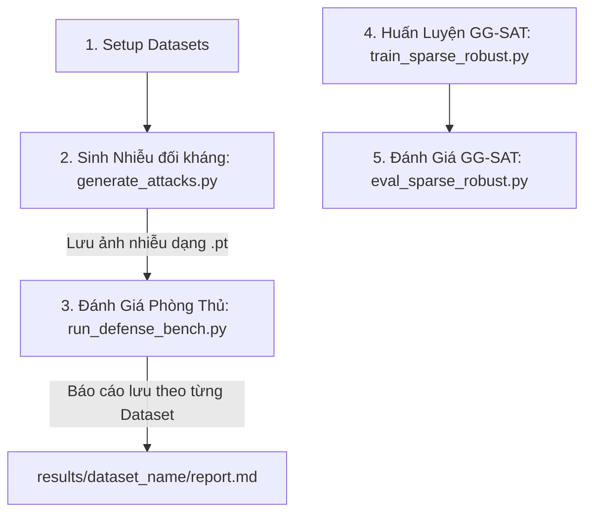

# Hướng Dẫn Sử Dụng Giao Diện Dòng Lệnh (CLI Guide) cho Dự Án AA & GG-SAT

Tài liệu này cung cấp hướng dẫn đầy đủ, chi tiết và có cấu trúc để chạy toàn bộ quy trình: từ thiết lập dữ liệu (Dataset Setup), sinh ảnh đối kháng (AA Generation), đánh giá phương thức phòng thủ (Defense Evaluation) đến huấn luyện mô hình bền bỉ (Robust Model Training).

---

## 1. Tổng Quan Quy Trình

Quy trình hoạt động được thiết kế theo cơ chế **Decoupled Architecture** (Tách biệt hoàn toàn phần Sinh Nhiễu và phần Đánh Giá Phòng Thủ). Điều này giúp tiết kiệm thời gian chạy thử nghiệm đáng kể vì ảnh nhiễu chỉ cần được tạo một lần duy nhất.



---

## 2. Các Bước Thực Hiện và Câu Lệnh CLI Chi Tiết

### Bước 1: Thiết Lập Dữ Liệu (`setup_datasets.py`)

Kịch bản giúp chuẩn bị dữ liệu kiểm thử cho các bộ dữ liệu **CIFAR-100**, **Tiny-ImageNet**, và **ImageNet**. Hỗ trợ chế độ `--mock` để tự sinh thư mục giả lập siêu nhanh để kiểm tra tính khả thi của code mà không cần tải dữ liệu thật (150GB+).

**Cú pháp CLI:**
```bash
venv/bin/python3 scripts/setup_datasets.py --dataset [cifar100|tiny_imagenet|imagenet|all] [--mock] [--data_dir PATH]
```

**Ví dụ:**
- *Tạo cấu trúc dữ liệu giả lập cho tất cả dataset để test nhanh:*
  ```bash
  venv/bin/python3 scripts/setup_datasets.py --dataset all --mock
  ```
- *Tải và thiết lập thực tế cho Tiny-ImageNet:*
  ```bash
  venv/bin/python3 scripts/setup_datasets.py --dataset tiny_imagenet
  ```

---

### Bước 2: Sinh Ảnh Đối Kháng Độc Lập (`generate_attacks.py`)

Chạy các thuật toán tấn công đối kháng (Clean, FGSM, BIM, PGD, Top-k Sparse PGD) trên dataset và model tương ứng, sau đó lưu kết quả thành tệp `.pt` độc lập.

**Cú pháp CLI:**
```bash
venv/bin/python3 scripts/generate_attacks.py --dataset [cifar10|cifar100|tiny_imagenet|imagenet] --model [resnet18|trades|gg_sat] --batches NUM_BATCHES --batch_size BATCH_SIZE
```

**Ví dụ:**
- *Sinh ảnh đối kháng thử nghiệm nhanh (2 batches, batch_size 32) cho CIFAR-100:*
  ```bash
  venv/bin/python3 scripts/generate_attacks.py --dataset cifar100 --model resnet18 --batches 2 --batch_size 32
  ```

---

### Bước 3: Đánh Giá Các Phương Pháp Phòng Thủ (`run_defense_bench.py`)

Tải trực tiếp các ảnh đối kháng đã lưu ở **Bước 2** để đánh giá hiệu năng của 7 bộ lọc phòng thủ (Median Filter, JPEG Compression, randomized smoothing...). Kết quả báo cáo được lưu biệt lập theo từng Dataset.

**Cú pháp CLI:**
```bash
venv/bin/python3 scripts/run_defense_bench.py --dataset [cifar10|cifar100|tiny_imagenet|imagenet] --batches NUM_BATCHES --batch_size BATCH_SIZE
```

**Đầu ra:**
- Báo cáo Markdown: `results/[dataset]/defense_report.md`
- Dữ liệu CSV chi tiết: `results/[dataset]/defense_results.csv`

**Ví dụ:**
- *Chạy thử nghiệm đánh giá phòng thủ nhanh trên CIFAR-100:*
  ```bash
  venv/bin/python3 scripts/run_defense_bench.py --dataset cifar100 --batches 2 --batch_size 32
  ```

---

### Bước 4: Huấn Luyện Mô Hình Bền Bỉ GG-SAT (`train_sparse_robust.py`)

Huấn luyện mô hình ResNet-18 trên CIFAR-10 chống lại các đòn tấn công thưa bằng phương pháp **GG-SAT** với cơ chế Randomized k-ratio động.

**Cú pháp CLI:**
```bash
venv/bin/python3 scripts/train_sparse_robust.py \
    --epochs EPOCHS \
    --batch_size BATCH_SIZE \
    --k_min K_MIN \
    --k_max K_MAX \
    [--pure] \
    --beta BETA \
    --lr LEARNING_RATE
```

**Tham số chính:**
- `--epochs`: Số epoch huấn luyện (Mặc định: 100).
- `--k_min` và `--k_max`: Khoảng ngẫu nhiên hóa tỷ lệ pixel bị nhiễu (Mặc định: `0.3` đến `0.7`).
- `--pure`: Kích hoạt chế độ huấn luyện đối kháng thuần túy (Purely Adversarial). Nếu không bật, mặc định chạy **Mixed Training**.
- `--beta`: Hệ số của Loss đối kháng trong Mixed Training (Mặc định: `0.5`).

**Ví dụ:**
- *Huấn luyện nhanh 1 Epoch (test code):*
  ```bash
  venv/bin/python3 scripts/train_sparse_robust.py --epochs 1 --batch_size 64 --val_size 32
  ```
- *Huấn luyện Mixed Training chuẩn (100 Epochs):*
  ```bash
  venv/bin/python3 scripts/train_sparse_robust.py --epochs 100 --batch_size 128 --k_min 0.3 --k_max 0.7
  ```

---

### Bước 5: Đánh Giá Độc Lập GG-SAT (`eval_sparse_robust.py`)

Đánh giá hiệu năng phòng thủ của mô hình GG-SAT tự huấn luyện so với các mô hình standard và robust chuẩn.

**Cú pháp CLI:**
```bash
venv/bin/python3 scripts/eval_sparse_robust.py --batches NUM_BATCHES --batch_size BATCH_SIZE
```

**Ví dụ:**
```bash
venv/bin/python3 scripts/eval_sparse_robust.py --batches 4 --batch_size 128
```

---

## 3. Đánh Giá Mở Rộng & Chuyên Sâu (Evaluation & Analytics)

Các script trong phần này được thiết kế để đánh giá chi tiết phương thức tấn công Top-k PGD, so sánh với các baseline SOTA (SparseFool, GreedyFool) và phân tích sâu các khía cạnh của phương pháp.

### 3.1 Chạy Benchmark Cuối Cùng (`run_final_bench.py`)

Chạy benchmark tổng hợp tất cả các thuật toán tấn công (Clean, FGSM, PGD, BIM, Sparse-PGD, SparseFool, GreedyFool, và Proposed Top-k PGD). Đánh giá các metric nâng cao như LPIPS, SSIM, PSNR.

**Cú pháp CLI:**
```bash
venv/bin/python3 scripts/run_final_bench.py [--batches NUM] [--batch_size SIZE]
```

**Ví dụ:**
- *Chạy test nhanh:*
  ```bash
  venv/bin/python3 scripts/run_final_bench.py --batches 1 --batch_size 10
  ```
- *Đầu ra:* `results/final_results.csv`

### 3.2 Phân Tích Thực Nghiệm Ablation (`run_ablation.py`)

Thực hiện các thử nghiệm ablation để cô lập và đánh giá tầm quan trọng của cơ chế Dynamic Mask và Score EMA Smoothing trong thuật toán tấn công.

**Cú pháp CLI:**
```bash
venv/bin/python3 scripts/run_ablation.py [--quick]
```

**Ví dụ:**
- *Chạy kiểm tra nhanh:*
  ```bash
  venv/bin/python3 scripts/run_ablation.py --quick
  ```
- *Đầu ra:* `results/ablation/ablation_results.csv`

### 3.3 Đánh Giá ASR Phân Rã Theo Lớp (`run_classwise_analysis.py`)

Tính toán Attack Success Rate (ASR) phân tầng theo từng lớp ảnh cụ thể (ví dụ: máy bay, ô tô, chim, chó mèo...) để kiểm tra xem thuật toán có bị thiên lệch với một lớp cụ thể nào không.

**Cú pháp CLI:**
```bash
venv/bin/python3 scripts/run_classwise_analysis.py [--batches NUM] [--batch_size SIZE]
```

**Ví dụ:**
- *Chạy phân tích:*
  ```bash
  venv/bin/python3 scripts/run_classwise_analysis.py --batches 1 --batch_size 10
  ```
- *Đầu ra:* `results/classwise/classwise_asr.csv`

---

## 4. Trích Xuất Báo Cáo & Biểu Đồ (Paper Assets)

Phần này chứa script phục vụ trực tiếp cho việc viết báo cáo và bài báo khoa học.

### Sinh Biểu Đồ & Bảng LaTeX (`make_paper_assets.py`)

Đọc dữ liệu từ file `results/final_results.csv` và tự động sinh ra các biểu đồ so sánh (Accuracy, ASR, SSIM, PSNR, LPIPS vs. K-Ratio/Iterations) cùng với các bảng LaTeX chuẩn định dạng bài báo.

**Cú pháp CLI:**
```bash
venv/bin/python3 scripts/make_paper_assets.py
```

**Đầu ra:** Các file ảnh `.png` và file `.tex` được lưu tại `results/paper_assets/`.

---
**Lưu ý chung:** Toàn bộ các script đều tự động nhận diện thiết bị khả dụng (CUDA/MPS/CPU). Trước khi chạy, luôn đảm bảo môi trường ảo đã được kích hoạt thông qua lệnh `source venv/bin/activate`.
