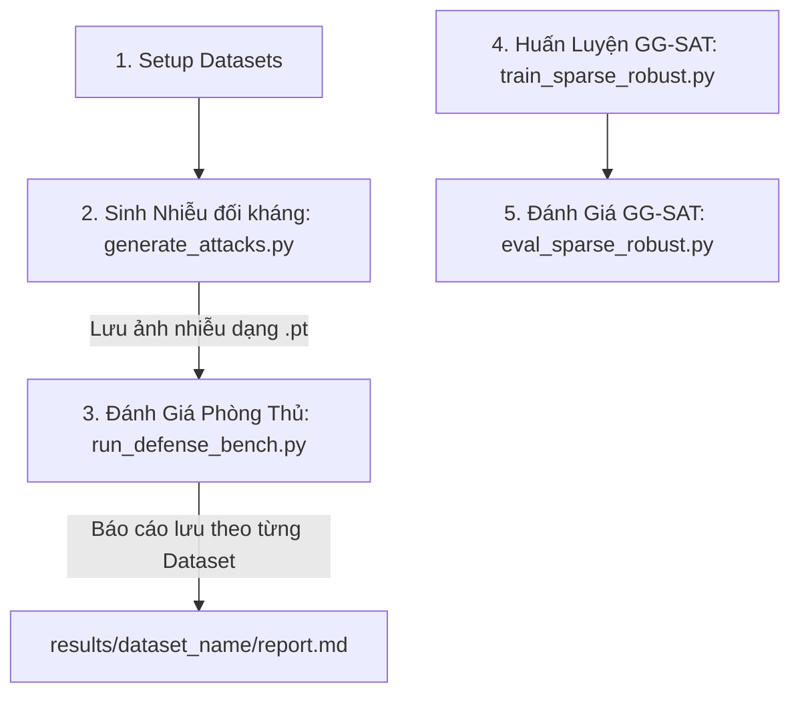

# Hướng Dẫn Sử Dụng Giao Diện Dòng Lệnh (CLI Guide) cho Dự Án AA & GG-SAT

Tài liệu này cung cấp hướng dẫn đầy đủ, chi tiết và có cấu trúc để chạy toàn bộ quy trình: từ thiết lập dữ liệu (Dataset Setup), sinh ảnh đối kháng (AA Generation), đánh giá phương thức phòng thủ (Defense Evaluation) đến huấn luyện mô hình bền bỉ (Robust Model Training).

---

## 1. Tổng Quan Quy Trình

Quy trình hoạt động được thiết kế theo cơ chế **Decoupled Architecture** (Tách biệt hoàn toàn phần Sinh Nhiễu và phần Đánh Giá Phòng Thủ). Điều này giúp tiết kiệm thời gian chạy thử nghiệm đáng kể vì ảnh nhiễu chỉ cần được tạo một lần duy nhất.



---

## 2. Các Bước Thực Hiện và Câu Lệnh CLI Chi Tiết

### Bước 1: Thiết Lập Dữ Liệu (`setup_datasets.py`)

Kịch bản giúp chuẩn bị dữ liệu kiểm thử cho các bộ dữ liệu **CIFAR-100**, **Tiny-ImageNet**, và **ImageNet**. Hỗ trợ chế độ `--mock` để tự sinh thư mục giả lập siêu nhanh để kiểm tra tính khả thi của code mà không cần tải dữ liệu thật (150GB+).

**Cú pháp CLI:**
```bash
venv/bin/python3 scripts/setup_datasets.py --dataset [cifar100|tiny_imagenet|imagenet|all] [--mock] [--data_dir PATH]
```

**Ví dụ:**
- *Tạo cấu trúc dữ liệu giả lập cho tất cả dataset để test nhanh:*
  ```bash
  venv/bin/python3 scripts/setup_datasets.py --dataset all --mock
  ```
- *Tải và thiết lập thực tế cho Tiny-ImageNet:*
  ```bash
  venv/bin/python3 scripts/setup_datasets.py --dataset tiny_imagenet
  ```

---

### Bước 2: Sinh Ảnh Đối Kháng Độc Lập (`generate_attacks.py`)

Chạy các thuật toán tấn công đối kháng (Clean, FGSM, BIM, PGD, Top-k Sparse PGD) trên dataset và model tương ứng, sau đó lưu kết quả thành tệp `.pt` độc lập.

**Cú pháp CLI:**
```bash
venv/bin/python3 scripts/generate_attacks.py --dataset [cifar10|cifar100|tiny_imagenet|imagenet] --model [resnet18|trades|gg_sat] --batches NUM_BATCHES --batch_size BATCH_SIZE
```

**Ví dụ:**
- *Sinh ảnh đối kháng thử nghiệm nhanh (2 batches, batch_size 32) cho CIFAR-100:*
  ```bash
  venv/bin/python3 scripts/generate_attacks.py --dataset cifar100 --model resnet18 --batches 2 --batch_size 32
  ```

---

### Bước 3: Đánh Giá Các Phương Pháp Phòng Thủ (`run_defense_bench.py`)

Tải trực tiếp các ảnh đối kháng đã lưu ở **Bước 2** để đánh giá hiệu năng của 7 bộ lọc phòng thủ (Median Filter, JPEG Compression, randomized smoothing...). Kết quả báo cáo được lưu biệt lập theo từng Dataset.

**Cú pháp CLI:**
```bash
venv/bin/python3 scripts/run_defense_bench.py --dataset [cifar10|cifar100|tiny_imagenet|imagenet] --batches NUM_BATCHES --batch_size BATCH_SIZE
```

**Đầu ra:**
- Báo cáo Markdown: `results/[dataset]/defense_report.md`
- Dữ liệu CSV chi tiết: `results/[dataset]/defense_results.csv`

**Ví dụ:**
- *Chạy thử nghiệm đánh giá phòng thủ nhanh trên CIFAR-100:*
  ```bash
  venv/bin/python3 scripts/run_defense_bench.py --dataset cifar100 --batches 2 --batch_size 32
  ```

---

### Bước 4: Huấn Luyện Mô Hình Bền Bỉ GG-SAT (`train_sparse_robust.py`)

Huấn luyện mô hình ResNet-18 trên CIFAR-10 chống lại các đòn tấn công thưa bằng phương pháp **GG-SAT** với cơ chế Randomized k-ratio động.

**Cú pháp CLI:**
```bash
venv/bin/python3 scripts/train_sparse_robust.py \
    --epochs EPOCHS \
    --batch_size BATCH_SIZE \
    --k_min K_MIN \
    --k_max K_MAX \
    [--pure] \
    --beta BETA \
    --lr LEARNING_RATE
```

**Tham số chính:**
- `--epochs`: Số epoch huấn luyện (Mặc định: 100).
- `--k_min` và `--k_max`: Khoảng ngẫu nhiên hóa tỷ lệ pixel bị nhiễu (Mặc định: `0.3` đến `0.7`).
- `--pure`: Kích hoạt chế độ huấn luyện đối kháng thuần túy (Purely Adversarial). Nếu không bật, mặc định chạy **Mixed Training**.
- `--beta`: Hệ số của Loss đối kháng trong Mixed Training (Mặc định: `0.5`).

**Ví dụ:**
- *Huấn luyện nhanh 1 Epoch (test code):*
  ```bash
  venv/bin/python3 scripts/train_sparse_robust.py --epochs 1 --batch_size 64 --val_size 32
  ```
- *Huấn luyện Mixed Training chuẩn (100 Epochs):*
  ```bash
  venv/bin/python3 scripts/train_sparse_robust.py --epochs 100 --batch_size 128 --k_min 0.3 --k_max 0.7
  ```

---

### Bước 5: Đánh Giá Độc Lập GG-SAT (`eval_sparse_robust.py`)

Đánh giá hiệu năng phòng thủ của mô hình GG-SAT tự huấn luyện so với các mô hình standard và robust chuẩn.

**Cú pháp CLI:**
```bash
venv/bin/python3 scripts/eval_sparse_robust.py --batches NUM_BATCHES --batch_size BATCH_SIZE
```

**Ví dụ:**
```bash
venv/bin/python3 scripts/eval_sparse_robust.py --batches 4 --batch_size 128
```
