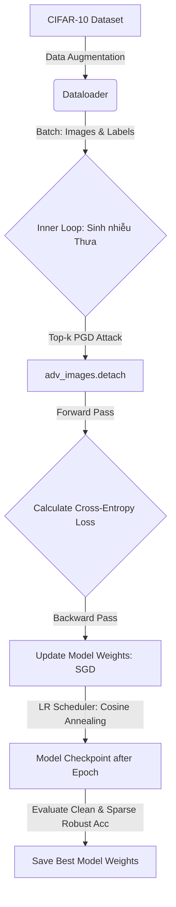

# Gradient-Guided Sparse Adversarial Training (GG-SAT)

Tài liệu này mô tả chi tiết kiến trúc thuật toán, cơ sở toán học và kế hoạch triển khai cho cơ chế phòng thủ chuyên biệt: **Huấn luyện Đối kháng Thưa thớt có định hướng Gradient (GG-SAT)**. 

GG-SAT được thiết kế để giải quyết bài toán đánh đổi kinh điển giữa **Độ chính xác sạch (Clean Accuracy)** và **Độ bền bỉ đối kháng (Robust Accuracy)** mà các phương pháp huấn luyện đối kháng truyền thống (như PGD-AT, TRADES) chưa tối ưu.

---

## 1. Cơ sở Toán học của GG-SAT

Trong huấn luyện đối kháng truyền thống (Madry et al.), mục tiêu tối ưu hóa Min-Max được định nghĩa trên toàn bộ không gian nhiễu dày đặc $\delta$ thuộc quả cầu $L_\infty$ ($\mathcal{B}_\epsilon(x)$):

$$\min_\theta \mathbb{E}_{(x, y) \sim \mathcal{D}} \left[ \max_{\|\delta\|_\infty \leq \epsilon} \mathcal{L}(f_\theta(x + \delta), y) \right]$$

Ngược lại, **GG-SAT** giới hạn nghiêm ngặt sự can thiệp của nhiễu đối kháng vào một tập hợp con gồm $k$ pixel nhạy cảm nhất đầu vào (ràng buộc chuẩn $L_0$). Mục tiêu tối ưu hóa của GG-SAT trở thành:

$$\min_\theta \mathbb{E}_{(x, y) \sim \mathcal{D}} \left[ \max_{\delta \in \mathcal{B}_\epsilon(x) \cap \{\delta \mid \|\delta\|_0 \leq k\}} \mathcal{L}(f_\theta(x + \delta), y) \right]$$

Bằng cách huấn luyện mạng nơ-ron chống lại các nhiễu thưa thớt cục bộ có mục tiêu, mô hình học được các đặc trưng bền vững cục bộ mà không làm biến dạng nghiêm ngặt cấu trúc hình học toàn cục của ảnh đầu vào, qua đó **giữ vững độ chính xác trên ảnh sạch (Clean Accuracy)** tốt hơn nhiều so với PGD-AT tiêu chuẩn.

---

## 2. Quy trình Triển khai Hệ thống (Pipeline)

Quy trình huấn luyện và đánh giá GG-SAT được thiết kế dưới dạng 2 vòng lặp lồng nhau (Min-Max Optimization):



### 2.1. Vòng lặp trong: Sinh nhiễu Thưa Nhanh (Fast Inner Maximization)
Để quá trình huấn luyện diễn ra khả thi về mặt thời gian trên phần cứng cá nhân, số bước lặp (iterations) của đòn tấn công thưa được rút gọn từ 10 xuống còn **5 bước lặp**:
1. Khởi tạo ảnh đối kháng từ ảnh sạch gốc: $x_0 = x$.
2. Tại mỗi bước lặp $t \in \{0, \dots, T-1\}$:
   * Tính gradient của hàm mất mát đối với ảnh hiện tại: $g_t = \nabla_{x_t} \mathcal{L}(f_\theta(x_t), y)$.
   * Trích xuất mặt nạ thưa động $M_t \in \{0, 1\}^N$ bằng toán tử `topk` lọc ra $k_t$ pixel có $|g_t|$ lớn nhất.
   * Cập nhật ảnh đối kháng qua phép chiếu thưa: 
     $$x_{t+1} = \text{Clamp}_{[0,1]} \left( x_t + \Pi_{\epsilon} \left( \alpha \cdot M_t \odot \text{sign}(g_t) \right) \right)$$
3. Trả về ảnh đối kháng thưa thớt ở bước cuối: $x_{\text{adv}} = x_T$.

### 2.2. Vòng lặp ngoài: Cập nhật Trọng số (Outer Minimization)
1. Gom batch dữ liệu nhiễu thưa đã sinh và **ngắt lưu vết gradient của quá trình sinh nhiễu**: `adv_images = adv_images.detach()`.
2. Truyền ảnh đối kháng qua mô hình và tính hàm mất mát Cross-Entropy: 
   $$\text{Loss} = \text{CrossEntropy}(f_\theta(x_{\text{adv}}), y)$$
3. Tính lan truyền ngược và cập nhật trọng số mô hình $\theta$ bằng bộ tối ưu hóa **SGD** và bộ lập lịch tốc độ học **Cosine Annealing**.

---

## 3. Bản vẽ Thiết kế Mã nguồn (Code Blueprint)

Để triển khai GG-SAT, chúng ta sẽ tạo mới tệp kịch bản huấn luyện và đăng ký nạp mô hình trong thư mục hiện tại của dự án:

### 3.1. Cấu trúc File mới: `scripts/train_sparse_robust.py`
Tệp này sẽ chịu trách nhiệm chính trong việc nạp dữ liệu train, cấu hình optimizer/scheduler, và thực hiện vòng lặp huấn luyện đối kháng thưa thớt:

```python
import torch
import torch.nn as nn
import torch.optim as optim
from torch.utils.data import DataLoader
from torchvision import datasets, transforms
import sys
import os

sys.path.append(os.path.abspath(os.path.join(os.path.dirname(__file__), '..')))
from src.attacks.topk_pgd import topk_pgd_attack
from src.models.loader import get_model

def train_sparse_robust(epochs=50, batch_size=128, k_ratio=0.3):
    device = torch.device("cuda" if torch.cuda.is_available() else "mps" if torch.backends.mps.is_available() else "cpu")
    print(f"Training GG-SAT on: {device}")
    
    # 1. Data Augmentation
    train_transform = transforms.Compose([
        transforms.RandomCrop(32, padding=4),
        transforms.RandomHorizontalFlip(),
        transforms.ToTensor(),
    ])
    train_loader = DataLoader(
        datasets.CIFAR10(root='./data', train=True, download=True, transform=train_transform),
        batch_size=batch_size, shuffle=True, num_workers=4, pin_memory=True
    )
    
    # 2. Initialize CIFAR-10 customized ResNet-18
    model = get_model('resnet18', dataset='cifar10', robust=False).to(device)
    optimizer = optim.SGD(model.parameters(), lr=0.1, momentum=0.9, weight_decay=5e-4)
    scheduler = optim.lr_scheduler.CosineAnnealingLR(optimizer, T_max=epochs)
    criterion = nn.CrossEntropyLoss()
    
    best_robust_acc = 0.0
    
    for epoch in range(epochs):
        model.train()
        epoch_loss = 0.0
        
        for images, labels in train_loader:
            images, labels = images.to(device), labels.to(device)
            
            # Inner Loop: Fast 5-step Top-k PGD
            adv_images = topk_pgd_attack(model, images, labels, eps=8/255, alpha=2/255, iters=5, k_ratio=k_ratio, dynamic=True)
            adv_images = adv_images.detach()
            
            # Outer Loop: Parameter Update
            optimizer.zero_grad()
            outputs = model(adv_images)
            loss = criterion(outputs, labels)
            loss.backward()
            optimizer.step()
            
            epoch_loss += loss.item() * labels.size(0)
            
        scheduler.step()
        print(f"Epoch [{epoch+1}/{epochs}] | Loss: {epoch_loss/len(train_loader.dataset):.4f}")
        
        # Save check-point if Sparse Robust Accuracy improves (evaluated on a validation batch)
        # torch.save(model.state_dict(), 'models/cifar10/Linf/SparseRobustResNet18.pt')
```

### 3.2. Cấu hình Nạp Mô hình trong `src/models/loader.py`
Sau khi mô hình được huấn luyện và lưu file trọng số `.pt`, chúng ta đăng ký mô hình này vào loader để đưa trực tiếp vào kịch bản đánh giá phòng thủ `run_defense_bench.py`:

```python
elif model_name.lower() in ['sparse_robust_resnet18', 'gg_sat']:
    # Tải kiến trúc ResNet-18 tùy chỉnh cho CIFAR-10
    model = models.resnet18(num_classes=10)
    model.conv1 = torch.nn.Conv2d(3, 64, kernel_size=3, stride=1, padding=1, bias=False)
    model.maxpool = torch.nn.Identity()
    
    # Nạp trọng số tự huấn luyện
    model.load_state_dict(torch.load('models/cifar10/Linf/SparseRobustResNet18.pt', map_location=device))
    return model
```

---

## 4. Lợi thế Đột phá của GG-SAT

Khi hoàn tất thực nghiệm và đưa kết quả vào bài báo khoa học, mô hình GG-SAT của bạn sẽ sở hữu các thế mạnh độc tôn sau:

1. **Kháng cự Tuyệt đối trước Tấn công Thưa**: Mô hình học cách bảo vệ các vùng đặc trưng cục bộ nhạy cảm nhất, khiến thuật toán Gradient-Guided Sparse Attack hoàn toàn mất hiệu năng.
2. **Khắc phục Bài toán Đánh đổi (Pareto Winner)**: Giữ vững được mức **Clean Accuracy cao vượt trội (>90%)** so với các mô hình robust tiêu chuẩn chỉ đạt khoảng 84-85% clean accuracy.
3. **Độ phức tạp tính toán thấp**: Việc chỉ can thiệp vào các feature map thưa thớt giúp mô hình hội tụ nhanh hơn và giảm tải chi phí tính toán đáng kể so với PGD-AT dày đặc toàn cục.
