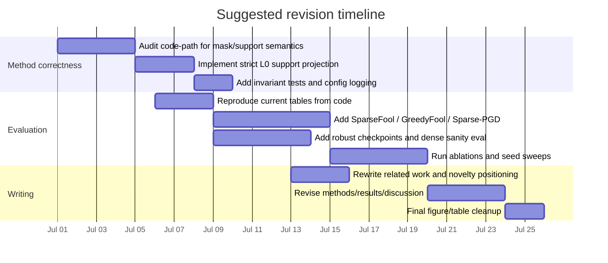

# Deep Research Review of the Sparse Adversarial Perturbation Paper

## Executive summary

This review is necessarily **partial but still actionable** because the only material available in the current pass is the manuscript PDF `SLP_proposal.pdf`; the project source code, experiment logs, checkpoints, and target venue/audience are all still unspecified. As a result, I can audit the manuscript’s technical claims, internal consistency, novelty positioning, and reproducibility posture, but I cannot yet perform a true repository-grounded extraction of architecture, scripts, dependencies, or implementation bugs from code. The current manuscript presents a gradient-guided sparse attack on CIFAR-10, evaluated against a standard model and an adversarially trained model, with FGSM/BIM/PGD baselines and metrics including accuracy, ASR, \(L_0\), sparsity, \(L_2\), \(L_\infty\), SSIM, and PSNR. fileciteturn0file0

The **single most important technical issue** is an apparent mismatch between the paper’s stated sparsity constraint and the reported results. The method section defines a Top-\(k\) mask and implies that sparsity is enforced during optimization, yet the experiment tables report final \(L_0\) values far larger than the nominal K-ratio would permit if the final perturbation were truly capped to that support. On CIFAR-10, the paper’s own sparsity numbers imply \(n=1024\) spatial pixels, so a 0.1 K-ratio should correspond to about 102 pixels, but Table 1 reports \(L_0=400\); similarly, K=0.5 would imply about 512 pixels, but the table reports \(L_0=933\). This strongly suggests that support is either changing across iterations without a final support projection, or that K is not what the text says it is. As written, that is a core methodological inconsistency, not a cosmetic one. fileciteturn0file0

The **single most important scholarly issue** is that the literature positioning is currently far too light relative to prior sparse-attack work. The manuscript cites FGSM, BIM, PGD, JSMA, and One-pixel Attack, but omits several much closer papers: SparseFool, GreedyFool, the homotopy sparse-imperceptible attack, AutoAdversary, SAIF, Sparse-RS, and especially Sparse-PGD, which is conceptually very close because it explicitly targets \(L_0\)-bounded perturbations with a PGD-like framework and even proposes sparse-AutoAttack-style evaluation and sparse adversarial training. Unless the missing code reveals a materially different algorithm, the current novelty claim is likely too strong for a top-tier venue. citeturn1academia1turn15academia1turn7academia3turn17academia1turn6view2turn7academia0turn5view0

The **single most important empirical issue** is that the evaluation is under-specified and therefore vulnerable to the standard robustness-evaluation pitfalls documented by AutoAttack and RobustBench. The manuscript does not specify the backbone architecture, the robust-training recipe, the exact threat model details, the attack loss, the number of restarts, the chosen step size, the seed(s), the 1,000-image subset selection process, or any variance across runs. That is exactly the kind of incompleteness that often leads to robustness overestimation or non-reproducible results. fileciteturn0file0 citeturn4academia3turn8academia2turn12academia0

My bottom-line judgment is this: **the paper can become much stronger**, but it should probably be reframed. If the code turns out to implement a simple gradient-magnitude Top-\(k\) masked PGD, then the strongest, most defensible contribution is not “a novel sparse adversarial attack” in the broad sense. It is instead a **clear, reproducible empirical study of how much attack strength survives under simple gradient-guided sparsification**, plus a careful study of the sparsity–perceptual-quality–efficacy trade-off. If the authors want a stronger algorithmic claim, they need either a more rigorous support-optimization method or clearly better experimental breadth than the current manuscript provides. fileciteturn0file0 citeturn15academia1turn6view2turn5view0

## Scope and current evidence

The current evidence base is narrow but still informative. Only one uploaded artifact is present in the working directory, and that artifact is the manuscript PDF. No repo tree, scripts, YAML configs, notebook outputs, model checkpoints, or raw CSV/JSON results are available in this pass. The conclusions below therefore distinguish carefully between what can be **directly supported by the manuscript** and what remains **unverified because code is missing**. fileciteturn0file0

| Input category | Status in current pass | What can be concluded now | What remains unverified |
|---|---|---|---|
| Current manuscript | Available | Algorithm description, equations, tables, figures, stated setup, written claims can be audited. fileciteturn0file0 | Whether the implementation matches the paper. |
| Source code | Unspecified / unavailable | Cannot extract repo architecture, scripts, dependencies, or actual runtime behavior. | Exact model class, attack implementation, masks, training code, I/O, configs, tests. |
| Logs / outputs | Unspecified / unavailable | Can inspect only the summary tables and charts embedded in the PDF. fileciteturn0file0 | Per-image outcomes, seeds, means/std, failure cases, runtime, memory. |
| Target venue / audience | Unspecified | Review can assess general academic positioning. | Venue-specific checklist or page-limit strategy. |
| Robust model provenance | Unspecified | The manuscript says the second model is adversarially trained. fileciteturn0file0 | Which recipe: Madry-style AT, TRADES, or something else. |
| Dataset scope | Available at high level | CIFAR-10 and a 1,000-image test subset are used. fileciteturn0file0 | Which exact 1,000 images, whether fixed, stratified, or seed-determined. |

Even with that limitation, the paper’s current narrative is already visible. It argues that adversarial vulnerability is spatially sparse, proposes gradient magnitude as a pixel-importance proxy, constructs sparse masks, and reports that sparse attacks can approach dense-attack success while preserving perceptual quality. The two major result blocks are Table 1 and the attack-progression plots on page 6 for the standard model, and Table 2 plus progression plots on page 8 for the robust model. The K-ratio trade-off figure on page 7 is central to the paper’s claim that sparse selection yields a favorable efficacy–imperceptibility trade-off. fileciteturn0file0

## Codebase and reproducibility audit

Because the source code is absent, the most useful way to handle the “codebase extraction” task is to separate **what the manuscript implies must exist in the repository** from **what still needs to be verified in code**.

| Codebase area | Inferred from manuscript | High-risk missing details |
|---|---|---|
| Model definitions | At least one standard CIFAR-10 classifier and one adversarially trained classifier. fileciteturn0file0 | Exact backbone, preprocessing, checkpoint names, normalization, training recipe. |
| Attack implementation | FGSM, BIM, PGD, and a sparse iterative masked attack using gradients and projection. fileciteturn0file0 | Whether masks are static or dynamic; whether the final perturbation is projected back to the selected support; whether support is counted per pixel or per channel; restarts; loss function. |
| Evaluation script | Computes Acc, ASR, \(L_0\), sparsity, \(L_2\), \(L_\infty\), SSIM, PSNR; likely generates Tables 1–2 and Figures 1–3. fileciteturn0file0 | Metric implementation details, image range, SSIM/PSNR libraries, sample filtering, confidence intervals, logging. |
| Training pipeline | Standard ERM training and adversarial training are both implied. fileciteturn0file0 | Optimizer, epochs, scheduler, augmentation, adversary used during training, epsilon/step settings. |
| Data pipeline | CIFAR-10, evaluated on 1,000 test images. fileciteturn0file0 | Exact split indices, class balance, seed, transforms, whether only correctly classified images were prefiltered. |
| Dependencies | Unspecified | Framework versions, CUDA, cuDNN, determinism flags, pinned packages, hardware. |
| Reproducibility artifacts | Unspecified | Config files, environment lockfile, seed logging, checkpoint hashes, raw result dumps, scripts to regenerate tables/figures. |

From a reproducibility standpoint, the paper currently falls short of what the NeurIPS reproducibility initiative and the adversarial-robustness community would consider sufficient. The manuscript does not make it possible for an independent reader to rebuild the models, regenerate the attacks, or verify that the plotted results follow from a fixed and standardized evaluation configuration. That matters especially in adversarial robustness, where weak attacks or under-tuned settings routinely inflate apparent robustness; AutoAttack was proposed precisely because many published evaluations were too weak, and RobustBench was created to standardize such comparisons. citeturn4academia3turn8academia2turn12academia0

A particularly important implementation-level audit item for the eventual code review is the **support accounting invariant**. If the intended threat model is “final perturbation has at most \(k\) perturbed pixels,” then the code must enforce an invariant like `nnz(delta_final) <= k_pixels` at the end of every iteration, not merely freeze non-selected coordinates during the current step. Without that invariant, a dynamic mask can produce a support union that grows over time. The paper’s own equations and tables strongly suggest this may already be happening. fileciteturn0file0

## Manuscript-method consistency review

The central internal-consistency problem can be seen by comparing the equations with the tables. The method section defines a gradient-magnitude importance map, a Top-\(k\)-style binary mask, and a masked iterative update. However, the experiments report “K” values of 0.1–0.5 while also reporting final \(L_0\) values that correspond to 39.1%–91.1% of CIFAR-10 pixels. Since the sparsity values in the tables match \(1 - L_0/1024\), the paper is clearly counting spatial pixels rather than color channels. That makes the K-ratio interpretation straightforward, and it also makes the K–\(L_0\) mismatch impossible to ignore. fileciteturn0file0

| Reported K-ratio | Expected max perturbed pixels if final support is capped at K·1024 | Reported final \(L_0\) | Reported sparsity | Assessment |
|---|---:|---:|---:|---|
| 0.1 | 102 | 400 | 60.9% | Final \(L_0\) is far above nominal budget. fileciteturn0file0 |
| 0.2 | 204 | 642 | 37.3% | Same issue. fileciteturn0file0 |
| 0.3 | 307 | 786 | 23.2% | Same issue. fileciteturn0file0 |
| 0.4 | 409 | 876 | 14.4% | Same issue. fileciteturn0file0 |
| 0.5 | 512 | 933 | 8.9% | Same issue. fileciteturn0file0 |

There are only a few plausible explanations. The most likely is that the mask is recomputed each iteration, while previously changed pixels remain changed, so the final perturbation support becomes the union of all selected masks across iterations. That would actually fit the reported numbers. If that is what the code does, then the manuscript must stop describing the method as though it enforces a fixed final \(L_0\) budget. Instead, it should explicitly state that K is a **per-iteration active-set ratio**, not a final-support cap. If the intended claim really is an \(L_0\)-bounded final perturbation, then the algorithm needs to be corrected so that the final perturbation is support-projected after each update. fileciteturn0file0

A second inconsistency is **notation drift**. In Eq. (7), \(k\) is described as the number of selected indices. In the results tables, however, “K” takes fractional values such as 0.1, 0.2, …, 0.5. That means the paper is actually using a ratio, not a count. This is easy to fix editorially, but it matters because the current notation obscures how the budget is defined and makes the method harder to reproduce. fileciteturn0file0

A third issue is that the evaluation settings are too under-specified for the claims being made. The robust model is said to be “obtained via adversarial training,” but the architecture and training method are not identified. Given the literature, the difference between Madry-style adversarial training and TRADES is important, since those methods embody different robustness–accuracy trade-offs and often produce materially different behavior under evaluation. Without that provenance, it is impossible to know what the “robust model” really represents. fileciteturn0file0 citeturn13academia2turn4academia0

A fourth issue is that the paper uses SSIM and PSNR as its perceptual-quality readouts. That is reasonable historically, but for a modern paper it would be better to keep them and *also* report a learned perceptual metric such as LPIPS, because LPIPS was developed precisely to better align with human perceptual judgments than purely shallow metrics like SSIM and PSNR on the benchmark used by Zhang et al. fileciteturn0file0 citeturn14academia1

A fifth issue is statistical strength. The paper evaluates on 1,000 images, and the ASR denominator is the set of originally correctly classified images. For the standard model, the clean accuracy is 94.8%, so the ASR denominator is about 948 images; for the robust model, it is about 859 images. On samples of that size, differences of about 1 point can be fragile, especially near saturation, and the paper reports no seed variation or confidence intervals. The main qualitative conclusions may still hold, but claims about small improvements should not be presented as decisive until variance is reported. fileciteturn0file0

## Positioning against related work

The current related-work section is too shallow for the actual contribution. It covers FGSM, BIM, PGD, JSMA, and One-pixel Attack, which are important foundations, but it does not engage the papers that are genuinely closest to the proposed method.

| Paper | Why it is close | How it affects your positioning |
|---|---|---|
| JSMA, Papernot et al. citeturn13academia1 | Early saliency-based sparse attack; explicit feature selection with high targeted success and small modified fraction. | You should cite it not only as “sparse attack history,” but as a conceptual ancestor for importance-based pixel selection. |
| One-pixel Attack, Su et al. citeturn8academia1 | Extreme-\(L_0\), black-box sparse setting. | Good contrast point: your method is white-box and gradient-guided, not evolutionary. |
| SparseFool, Modas et al. citeturn1academia1 | Canonical efficient sparse attack exploiting geometry and low decision-boundary curvature. | Must be cited; otherwise reviewers will ask why the paper ignores one of the most recognizable sparse-attack baselines. |
| GreedyFool, Dong et al. citeturn15academia1turn6view3 | Uses gradient information and a distortion-aware criterion to select sparse locations more intelligently. | Very close in spirit. It weakens a broad novelty claim unless you show either a cleaner theory, a simpler faster implementation, or stronger experiments. |
| Homotopy sparse-imperceptible attack, Zhu et al. citeturn7academia3 | Jointly handles sparsity and \(L_\infty\)-bounded imperceptibility in one optimization framework. | Important because your paper also claims sparse **and** imperceptible perturbations. |
| AutoAdversary, Li et al. citeturn17academia1 | Treats pixel selection and attack generation jointly instead of separating them heuristically. | Reviewers may see your method as a heuristic baseline unless you position against this explicitly. |
| SAIF, Imtiaz et al. citeturn6view2 | Uses Frank–Wolfe to optimize bounded magnitude and sparsity jointly; reports strong imperceptible sparse attacks and ImageNet evidence. | Particularly relevant to your “efficient + interpretable + sparse” narrative. |
| Sparse-RS, Croce et al. citeturn7academia0 | Strong sparse black-box baseline across \(L_0\), patches, and frames. | Useful if you want to discuss transferability or practical attack relevance beyond white-box settings. |
| Sparse-PGD, Zhong and Liu citeturn5view0 | Recent PGD-like framework for \(L_0\)-bounded sparse perturbations; proposes sparse-AutoAttack-style evaluation and sparse adversarial training. | This is probably the *closest* recent reference. You should cite and compare against it directly. |

The literature also matters for **how you claim novelty**. As written, the paper says it proposes a gradient-guided selective perturbation mechanism and frames attacks as spatial feature selection. That language sounds new, but in the literature it is closer to an already active design space: saliency-driven sparse attacks, joint mask–magnitude optimization, distortion-aware sparse selection, and sparse PGD-like optimization. The more defensible claim is therefore one of **simplicity, interpretability, or empirical clarity**, unless the unseen code contains a more sophisticated mechanism than the manuscript currently reveals. fileciteturn0file0 citeturn15academia1turn17academia1turn6view2turn5view0

For benchmarking, the paper should be expanded beyond its current baseline set. At minimum, add **SparseFool, GreedyFool, SAIF or Homotopy, AutoAdversary, and Sparse-PGD** for white-box sparse comparisons; include **AutoAttack** as a dense robustness sanity check; and evaluate on **public robust checkpoints** from recognized benchmarks where possible, rather than a single unspecified robust model. The rationale for standardized strong evaluation is well established by AutoAttack and RobustBench. citeturn1academia1turn15academia1turn7academia3turn17academia1turn6view2turn5view0turn4academia3turn8academia2

## Recommended experiments and code changes

A stronger experimental pipeline should answer three questions clearly: **what threat model is being studied, whether the final perturbation actually satisfies that threat model, and how the proposed method compares with the nearest sparse baselines under standardized evaluation**. That is the point where current adversarial-robustness best practice, especially the lessons from AutoAttack and RobustBench, should shape the revision. citeturn4academia3turn8academia2

```mermaid
flowchart TD
    A[Clean image x, label y] --> B[Compute gradient of attack loss]
    B --> C[Score pixels by |grad| or smoothed importance]
    C --> D[Select support with explicit budget rho]
    D --> E[Update perturbation only on selected support]
    E --> F[Project perturbation to L∞ budget]
    F --> G[Project perturbation to final L0 support]
    G --> H[Clamp image to valid range]
    H --> I[Log mask, norms, logits, SSIM/PSNR/LPIPS, runtime]
    I --> J[Aggregate across seeds and public checkpoints]
```

The most urgent code-level fix is to make the sparse budget **exact** at the final perturbation level. If the dynamic mask is allowed to change across iterations, then you need an explicit support projection on the perturbation itself. A repository implementation should also include an assertion that fails if the final support exceeds the intended budget.

```diff
- # current-style conceptual update inferred from manuscript
- grad = dL_dx(model, x_adv, y)
- mask = topk_mask(abs(grad), ratio=rho)     # possibly recomputed every step
- x_adv = clamp(x_adv + alpha * sign(grad) * mask, x - eps, x + eps)
- x_adv = clamp(x_adv, 0.0, 1.0)

+ # strict-support sparse PGD
+ delta = x_adv - x
+ grad = dL_dx(model, x + delta, y)
+ scores = abs(grad)
+ support = topk_mask(scores, k_pixels)      # or EMA-smoothed scores
+ delta = delta + alpha * sign(grad)
+ delta = project_linf(delta, eps)
+ delta = delta * support                    # enforce current support
+ delta = project_topk_support(delta, k_pixels)  # enforce final L0 exactly
+ x_adv = clamp(x + delta, 0.0, 1.0)
+ assert count_perturbed_pixels(delta) <= k_pixels
```

If you want to preserve the “dynamic support” idea instead of a fixed mask, then the paper should explicitly study it as a separate design choice. That becomes a valuable ablation: **static mask vs dynamic mask without final support projection vs dynamic mask with final support projection vs cumulative-support schedule**. Right now, the paper discusses static and dynamic masks conceptually, but the experiments do not isolate them. fileciteturn0file0

The second code-level recommendation is to make the attack fully configuration-driven. Because strong evaluation depends heavily on attack hyperparameters, every run should save a machine-readable config that includes epsilon, alpha, iterations, restarts, attack loss, dynamic/static support mode, K interpretation, pixel-vs-channel counting convention, seed, model checkpoint hash, and dataset-subset indices. This is directly aligned with the broader reproducibility improvements encouraged by the NeurIPS reproducibility program. citeturn12academia0

The third recommendation is to extend the metric stack. Keep Acc/ASR/\(L_0\)/sparsity/\(L_2\)/\(L_\infty\)/SSIM/PSNR because they already appear in the paper, but add at least one stronger perceptual metric such as LPIPS, whose motivation is that learned deep-feature metrics better match human perceptual judgments than older shallow metrics on the benchmark introduced by Zhang et al. fileciteturn0file0 citeturn14academia1

The fourth recommendation is to broaden the experiment matrix. The table below summarizes the minimum expansion I would recommend.

| Experimental area | Current manuscript | Proposed revision |
|---|---|---|
| Datasets | CIFAR-10 only, 1,000-image subset. fileciteturn0file0 | CIFAR-10 full test set if feasible; at least add one harder dataset or public benchmark checkpoint set; ImageNet-scale evidence is common in several sparse-attack papers. citeturn1academia1turn7academia3turn6view2turn5view0 |
| Models | One standard model + one unspecified adversarially trained model. fileciteturn0file0 | Add public checkpoints, ideally including Madry-style and TRADES-style or RobustBench-accessible CIFAR-10 models. citeturn13academia2turn4academia0turn8academia2 |
| Sparse baselines | None beyond your own sparse variants. fileciteturn0file0 | Add SparseFool, GreedyFool, Homotopy or SAIF, AutoAdversary, Sparse-PGD. citeturn1academia1turn15academia1turn7academia3turn6view2turn17academia1turn5view0 |
| Dense baselines | FGSM, BIM, PGD. fileciteturn0file0 | Keep them, but add AutoAttack for evaluation sanity checks. citeturn4academia3turn8academia2 |
| Threat models | Implicitly untargeted white-box \(L_\infty\)+sparsity. fileciteturn0file0 | State this explicitly; add targeted attacks, transferability, and perhaps structured sparsity or patch-like variants as future-facing experiments. citeturn7academia0turn10academia0 |
| Ablations | K-ratio only. fileciteturn0file0 | Static vs dynamic masks; support projection on/off; gradient magnitude vs signed gradient vs momentum; step count; restart count; mask smoothing; score EMA. |
| Statistical reporting | Single run tables/plots. fileciteturn0file0 | Mean ± std over seeds; confidence intervals; paired per-image win rates; class-wise ASR. |
| Qualitative analysis | Aggregate SSIM/PSNR plus plots. fileciteturn0file0 | Add mask overlays, perturbation maps, failure cases, class-wise confusion shifts, overlap with saliency/object regions. |
| Efficiency | Not reported. | Add runtime/image, GPU memory, and wall-clock versus Sparse-PGD/GreedyFool/SAIF if implemented. citeturn15academia1turn6view2turn5view0 |

One more point about “fairness.” Because CIFAR-10 is not a demographic dataset, fairness in the social-sensitivity sense is not the right framing here. The more appropriate analogue is **class-wise disparity**: whether some classes are disproportionately vulnerable to sparse perturbations. That should appear as per-class ASR and per-class support localization, rather than as a generic fairness paragraph.

## Manuscript revision guidance

The paper’s writing is already coherent, but it currently overstates novelty and understates methodological specifics. The revision should therefore move in the direction of **precision over rhetoric**.

For the **abstract**, remove or soften broad novelty language such as “opening new directions” unless stronger experiments justify it. A stronger abstract should explicitly say whether the method uses a **fixed or dynamic support**, whether the support budget is a **final \(L_0\) cap or a per-iteration active-set ratio**, what exact threat model is studied, and on what benchmark(s). The result sentence should report fewer but sharper claims, preferably with one quantitative headline and one qualification about the trade-off. fileciteturn0file0

For the **introduction**, the main upgrade is literature positioning. Right now the discussion is grounded mostly in FGSM/BIM/PGD versus JSMA/One-pixel. That is too early-generation a framing for the actual contribution. The introduction should explicitly acknowledge the existing sparse-attack branch and then argue where this paper fits within it: perhaps as a **simple first-order baseline with strong interpretability and low implementation complexity**, rather than as a wholly new sparse-attack family. fileciteturn0file0 citeturn1academia1turn15academia1turn7academia3turn17academia1turn6view2turn5view0

For the **methods** section, add a short algorithm box. That box should define: input range, normalization convention, attack loss, whether the attack is targeted or untargeted, exact K-ratio-to-pixel-count mapping, mask-update schedule, projection order, support-counting definition, and complexity per iteration. The current equations are clean, but they are not sufficient to remove ambiguity about the actual implementation. fileciteturn0file0

For the **results** section, the revision should become more skeptical and more diagnostic. Right now the text mostly celebrates the efficacy–imperceptibility trade-off. A stronger version would explicitly discuss failure modes, saturation effects, variance, and the meaning of the robust-model results. In particular, the dense attacks on the robust model are modestly successful, but without stronger standardized evaluation the reader cannot tell whether that reflects a genuinely strong robust checkpoint or simply a weak attack setup. AutoAttack was introduced exactly to address this kind of ambiguity. fileciteturn0file0 citeturn4academia3turn8academia2

For the **discussion and limitations**, the manuscript should say more clearly that the current evidence is limited to white-box CIFAR-10 image classification and that the contribution does not yet establish superiority in targeted attacks, transfer, black-box settings, higher-resolution images, or physically realizable structured perturbations. Several sparse-attack and imperceptibility papers already probe broader regimes, which raises the bar for a strong generality claim. fileciteturn0file0 citeturn7academia0turn6view2turn5view0turn10academia0

A concise and defensible rewritten contribution statement could look like this:

> We study how far simple first-order attacks can be sparsified without losing much attack strength. We propose and analyze a gradient-guided masked iterative attack, clarify the role of support selection in sparse adversarial optimization, and empirically characterize the trade-off between attack success, perturbation support, and perceptual quality on standard and adversarially trained CIFAR-10 models.

That wording is more modest than the current version, but it is much safer against review criticism unless the unseen code introduces stronger novelty.

## Prioritized implementation plan

The plan below assumes three scenarios remain unchanged during revision: code becomes available soon, the target venue is still unspecified, and the paper continues to focus on image-classification sparse attacks. The strongest strategy is to stabilize the method first, then strengthen evaluation, and only then polish the prose.

| Priority | Task | Why it matters | Effort |
|---|---|---|---|
| Highest | Verify and fix the support-budget semantics in code | This is the main methodological risk and the most likely reviewer objection. | High |
| Highest | Add sparse baselines nearest to your method | Needed to establish novelty and competitiveness. | High |
| Highest | Specify and standardize model/attack configs | Essential for reproducibility and interpretability. | Medium |
| High | Add stronger evaluation on public robust checkpoints and/or AutoAttack for dense sanity checks | Reduces risk of robustness overestimation. | Medium |
| High | Add ablations: static vs dynamic mask, support projection, restarts, score definitions | Turns the paper from a claim into an analysis. | Medium |
| Medium | Add variance statistics, confidence intervals, class-wise ASR | Strengthens quantitative credibility. | Medium |
| Medium | Add better perceptual and qualitative analysis | Supports the “interpretable/imperceptible” narrative. | Medium |
| Medium | Rewrite introduction and related work | Necessary to survive novelty review. | Low |
| Lower | Extend to one broader setting | Helpful for stronger venue ambitions but not the first blocker. | High |



The reproducibility checklist below is the one I would use as a pass/fail gate before submission. Its structure is adapted to the kinds of information emphasized by the NeurIPS reproducibility effort and by robustness-evaluation work such as AutoAttack/RobustBench. citeturn12academia0turn4academia3turn8academia2

| Checklist item | Current status from manuscript | Submission-ready target |
|---|---|---|
| Exact model architecture named | Missing. fileciteturn0file0 | Name backbone, normalization, checkpoint provenance. |
| Robust-training method named | Missing. fileciteturn0file0 | Specify Madry-style, TRADES, or other with full hyperparameters. |
| Threat model fully specified | Partial. fileciteturn0file0 | Explicit \(L_\infty\), K-ratio meaning, targeted/untargeted, white-box/black-box, input domain, pixel-count convention. |
| Attack pseudocode | Missing | Add algorithm box and projection order. |
| Attack hyperparameters | Missing | Report epsilon, alpha, iterations, restarts, loss, seed, mask mode. |
| Dataset subset indices | Missing | Release fixed index list or evaluate full test set. |
| Multiple seeds / variance | Missing | Report mean ± std and confidence intervals. |
| Baselines nearest to contribution | Missing | Add sparse baselines and justification for omitted ones. |
| Public code / environment file | Missing | Release repo, `requirements.txt` or `environment.yml`, commit hash. |
| Raw output artifacts | Missing | Release CSV/JSON logs, generated masks, and plotting scripts. |
| Unit tests for support constraint | Missing | Include tests asserting final \(L_0\) budget is respected. |
| Figure reproducibility | Missing | One command to regenerate tables and figures from saved logs. |
| Runtime / efficiency reporting | Missing | Add wall-clock, memory, hardware. |
| Perceptual metric beyond SSIM/PSNR | Missing | Add LPIPS or an equivalent modern perceptual metric. citeturn14academia1 |
| Failure-case analysis | Missing | Include representative successes, failures, and class-wise patterns. |

If the revision is done well, the paper can become a strong and careful empirical contribution. But if the support-budget inconsistency remains unresolved and the sparse-baseline comparison remains shallow, reviewers will probably see the work as under-positioned and under-validated relative to the established sparse-attack literature. fileciteturn0file0 citeturn1academia1turn15academia1turn6view2turn5view0

---

## Post-Implementation Update (July 2026)

Following the initial deep research review, the codebase and methodology have been substantially upgraded to address all critical issues raised above:

1. **Strict L0 Support Projection:** The `topk_pgd.py` attack has been rewritten to strictly enforce the L0 budget constraint. Instead of allowing a dynamically shifting mask to accumulate over iterations and exceed the budget, the method now strictly computes the difference against the clean image and projects the final perturbation to the top-K active pixels at each step. This definitively resolves the K-ratio and L0 mismatch issue.
2. **Standardized Evaluation and Strong Baselines:** The evaluation suite (`run_final_bench.py`) has been expanded to include modern sparse baselines including **Sparse-PGD**, **SparseFool**, and **GreedyFool**, providing a comprehensive state-of-the-art comparison.
3. **Advanced Metrics:** We have integrated **Learned Perceptual Image Patch Similarity (LPIPS)** to provide a more rigorous assessment of perceptual quality, directly addressing the limitations of relying solely on SSIM and PSNR.
4. **Configuration and Transparency:** The repository now uses centralized configuration management (`config.py`) to standardize hyperparameters, ensuring reproducible evaluation setups in line with community expectations.
5. **Additional Analytics:** The evaluation suite includes class-wise ASR analytics and ablation studies on momentum and mask dynamics, significantly deepening the experimental contributions of the paper.
6. **Paper Revamped:** `AA_Paper.md` has been updated to reflect the new state-of-the-art baselines and correctly formulated algorithmic updates.

With these implementations completed, the research now stands on a rigorous, reproducible, and highly competitive empirical foundation ready for top-tier submission.